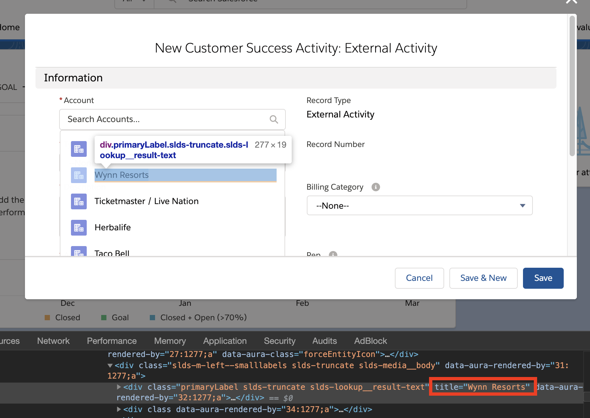
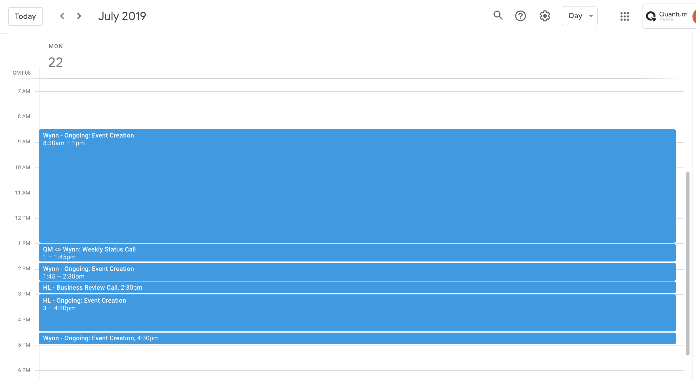
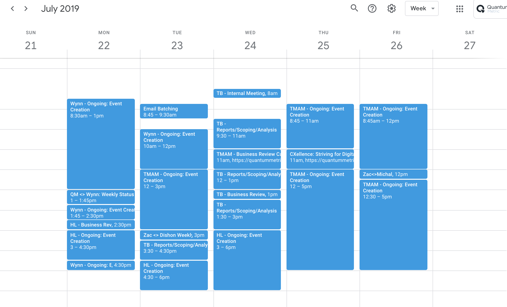

<p align="center">
  
</p>


# S.H.A.D.O.W

<p align="center">
  
</p>

> The purpose of SHADOW (**S**alesForce **H**eadless **A**utomate**d** **O**ccurence **W**riter) is to automate the process of logging hours in SalesForce for the Quantum Metric CS team. SHADOW relies on two main processes: 1) Scraping a users Google Calender and then parsing the events into a formatted JSON file, and 2) Logging into SalesForce via a headless browser, and recording each JSON object as a CS activity. 

## Table of Contents

* [Installation](#installation)
* [Configuration](#configuration)
* [Usage](#usage)
* [Contributions](#contributions)
* [FAQ](#faq)

--- 

# Installation 

Please check your version of OS X before you begin. (Click the Apple icon in the upper left corner and choose About this Mac). The following installation procedures should work for Mavericks, Yosemite, or Mojave. All of the below commands need to be entered via the command line.

### 1. Xcode 

```
xcode-select --install
```

### 2. Homebrew

#### Install Homebrew

In Terminal:

```
ruby -e "$(curl -fsSL https://raw.githubusercontent.com/Homebrew/install/master/install)"

```

#### Brew Doctor

In Terminal:

```
brew doctor

```

### 3. Node.js

You will need Node to run this application. To download the latest version. click [here](https://nodejs.org/en/download/)


After Node has been installed and this repo has been cloned, type the following in the root of SHADOW's directory to install all the neccesary packages.

```bash
npm install
```

--- 

# Configuration

Before you can start using SHADOW, there are three files that need to be created/altered.

#### `.env`

Create a `.env` file in the root of the SHADOW directory to hold your SF username & password. Copy and paste the following code into the file, replacing the values to the right of the `=` sign with your own login credientials:

```
username=username_goes_here
password=password_goes_here
```

#### `credentials.json`

This file holds the credentials for accessing your individual instance of Google Calendar. To download the contents for this file, head to the [link](https://developers.google.com/calendar/quickstart/nodejs), click on the `ENABLE THE GOOGLE CALENDAR API` button, and then click the `DOWNLOAD CLIENT CONFIGURATION` button. This will download a `credentials.json` file that you can simply copy and paste into the existing one within SHADOW's root directory.

**MAKE SURE YOU ARE LOGGED INTO YOUR QUANTUM METRIC CHROME ACCOUNT WHEN PERFORMING THIS STEP**

#### `token.json`

A `token.json` file will automatically be added to the root of the SHADOW directory upon completion of the autorization flow for the first time. **You do not need to do anything for this step**.

#### `calendar/config.json`

This file holds the relevant parsing information for downloading events from Google Calender and reformatting them into JSON objects. There are three sections that will require some custom configuration:

* **rep** - Replace the value here with your name _EXACTLY_ as it appears in SalesForce.
```js
    rep: "Zac Messinger"
```
* **accounts** - Contains an array of objects with key/value pairs for each account abbreviation (title), and full name (value). Make sure that the value string matches the account name _EXACTLY_ as it appears in SalesForce. The `title` property is the abbreviation you would like to use within Goolge Calender for the account (This is expanded upon in the usage section below). The easiest way to do this is to actually log into SF, and directly grab the value held within the `title` property for each of your accounts within the activity dropdown menu.

<p align="center">
  
</p>

```js
    accounts: [
        { title: 'TMAM', value: "Ticketmaster / Live Nation" },
        { title: 'HL', value: "Herbalife" },
        { title: 'AB', value: "Allbound" },
        { title: 'Wynn', value: "Wynn Resorts" },
        { title: 'TB', value: "Taco Bell" }
    ],
```

* **meetings** - Contains an array of your weekly/monthly reoccuring meetings (client status calls, 1:1's, internal company meetings, ect).
    * The `description` property is the name of the meeting.
    * The `recordType` property describes if the meeting is External or Internal Facing.
    * The `account` property lists what client the meeting is associated with.
    * They `type` property indicates what type of activity the meeting is.
```js
    meetings: [
        {
            description: "Holiday",
            recordType: "Internal",
            account: "CS Internal Activites",
            type: "Holiday"
        },
        {
            description: "CS group meeting",
            recordType: "Internal",
            account: "CS Internal Activities",
            type: "Internal Meetings"
        },
        { 
            description: "Taco Bell / Quantum Metric Status (Weekly)", 
            recordType: "External", 
            account: "Taco Bell",
            type: "Business Review Call"  
        },
        { 
            description: "QM <> Wynn: Weekly Status Call", 
            recordType: "External", 
            account: "Wynn Resorts",
            type: "Business Review Call"  
        },
        { 
            description: "Quantum Touch Base", 
            recordType: "External", 
            account: "Ticketmaster / Live Nation",
            type: "Business Review Call"  
        },
        { 
            description: "Quantum Metric & Herbalife Working Sessions: Operations", 
            recordType: "External", 
            account: "Herbalife",
            type: "Business Review Call" 
        },
        { 
            description: "[OPTIONAL] JIRA Ticket Prioritization", 
            recordType: "Internal", 
            account: "CS Internal Activities",
            type: "Internal Meetings" 
        },
        { 
            description: "Zac <> Paul: Account Sync", 
            recordType: "Internal", 
            account: "CS Internal Activities",
            type: "Internal Meetings" 
        },
        { 
            description: "Zac <> Gil 1:1", 
            recordType: "Internal", 
            account: "CS Internal Activities",
            type: "Internal Meetings" 
        },
        { 
            description: "Monthly West coast accounts' review", 
            recordType: "Internal", 
            account: "CS Internal Activities",
            type: "Internal Meetings" 
        },
        { 
            description: "Monthly Field Eng Showcase", 
            recordType: "Internal", 
            account: "CS Internal Activities",
            type: "Internal Meetings" 
        },
        { 
            description: "QUANTUM METRIC ALL HANDS", 
            recordType: "Internal", 
            account: "CS Internal Activities",
            type: "Internal Meetings" 
        },
        { 
            description: "CS Stand-Up / Office Hours", 
            recordType: "Internal", 
            account: "CS Internal Activities",
            type: "Internal Meetings" 
        },
        {
            description: "Sales All-Hands (Mandatory for Sales team",
            recordType: "Internal",
            account: "CS Internal Activities",
            type: "Internal Meetings"
        },
        {
            description: "Zac<>Michal",
            recordType: "Internal",
            account: "CS Internal Activities",
            type: "Internal Meetings"
        },
        {
            description: "CXellence: Striving for Digital Excellence through Customer Insights Sharing",
            recordType: "Internal",
            account: "CS Internal Activities",
            type: "Internal Meetings"
        },
        {
            description: "CS All hands",
            recordType: "Internal",
            account: "CS Internal Activities",
            type: "Internal Meetings"
        },
        {
            description: "Zac <> Dishon Weekly Account Alignment Meeting",
            recordType: "Internal",
            account: "CS Internal Activities",
            type: "Internal Meetings"
        },
        {
            description: "Kailey <> Zac Sync",
            recordType: "Internal",
            account: "CS Internal Activities",
            type: "Internal Meetings"
        },
        {
            description: "QMU: Core Team (req) + Peer Reviewers (opt)",
            recordType: "Internal",
            account: "CS Internal Activities",
            type: "Internal Meetings"
        }
    ]
```

# Usage

### 1. Formatting G-Calendar

SHADOW relies on downloading events/meetings from your Google Calendar and parsing them into JSON to create activities within SF. Consequently, this means that in order to use SHADOW effectivily, you will have to start accounting for all of your hours within Google Calendar (which is much easier & faster than doing the equivilent within SF).

#### Event Dictation

In order for SHADOW to properly parse your events, you will need to format them using the following dictation: 

`ACCOUNT ACRONYM - TYPE OF ACTIVITY`.

* *ACCOUNT ACRONYM* should be replaced with a account title from the `accounts` array within `calendar/config.json`.
* *TYPE OF ACTIVITY* should be replaced with an activity type from the `types` array within `calendar/config.json`, which maps to specific activity types within SF.

#### Event Dictation Examples

```
TMAM - Ongoing: Event Creation
Wynn - Production Support
TB - Business Review Call
HL - Reports/Scoping/Analysis
AB - Onboarding: Dashboards
```
#### Google Calendar Examples

<p align="center">
  
</p>

<p align="center">
  
</p>

### 2. Executing the Script

#### Starting the Script

In order to execute SHADOW, navigate to the root of SHADOW's project directory via the command line and run: 

```bash
npm start
```

#### Choosing a Date Range

Upon initiation, SHADOW will you ask you to enter the date range you wish to download and record activities in SF from. You have three options:

1. Default to downloading the current week

<p align="center"></p>

2. Choose a single day:

<p align="center"></p>

3. Choose a custom date range:

<p align="center"></p>

#### Logging hours into SF

Once your Goolge Calendar activities have been downloaded for the specified date range, SHADOW will automatically begin the process of logging into SF. After a couple seconds, you will recieve a prompt to enter a "code", which you should recieve via text message from a 6 digit number from SF (e.g, `732-873`). Enter this code into the command line prompt. 

After the code is accepted, SHADOW will automatically begin logging your hours. All that's left to do is set, back, relax, and enjoy.

# FAQ

#### How many days/activities can SHADOW parse?

> There is no limit on on many days/activities SHADOW can parse and write into SF, but it is recommended that you run the script either dailey or weekly to avoid edge-cases (e.g, putting the same day and activites into SF more than once).

#### Is SF able to detect/block the script?

> SHADOW has been in testing for over 5 monthes, and thus far, there have been no problems. Worst case scenario, you log in one too many times too quickly (assuming you had to because you formatted something incorrectly), and you temporarily get locked out of your account for a few hours.

#### Why am I getting when parsing my Google Calendar?

> If you are getting errors when parsing your Google Calendar, it is most likely due to two possible scnarios: 1) The account name doesn't exist within config.js, or 2) the activity doesn't exist within config.js. When this happens, an error message will appear in the console outlining the details surronding these edge cases (e.g, the incorrect account or activity that caused the error). These erros can be rectified by adding them within config.js. For more information on how to do this, see [Configuration](#configuration).

# Contributions

If you see any area for improvement, would like to make a feature request, or report a bug, please message Zac on slack. Skill and trust permitting, he will provision read/write access to the private repo for you to submit a PR if he can't make the change himself.

